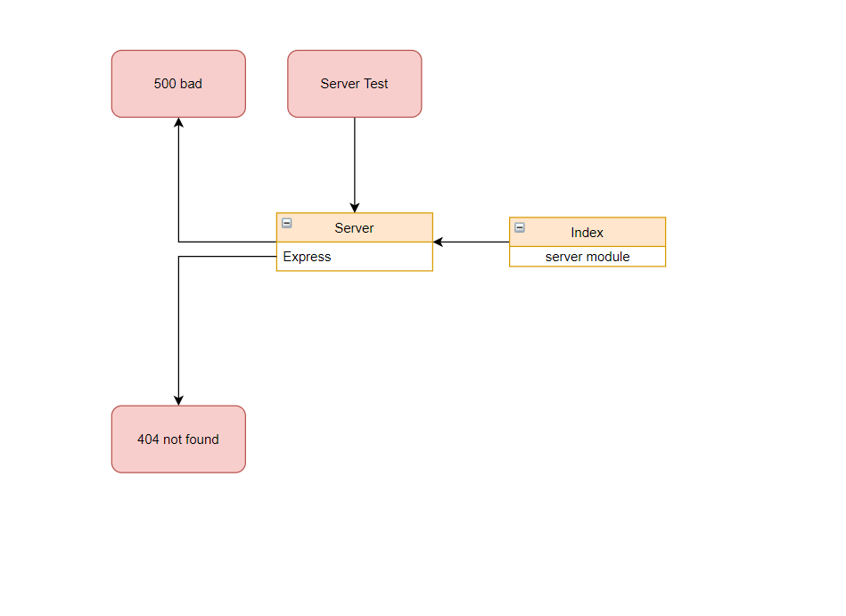

# server-deployment-practice

Name of feature: Testing enivronment using JEST.

Estimate of time needed to complete: 2 hours

Start time: 2:30pm

Finish time: 6:30pm

Actual time needed to complete: 4 hours

---

## UML

## Links

https://ramahi-server-deploy-dev.herokuapp.com/

https://ramahi-server-deploy-dev.herokuapp.com/

https://github.com/Mohammed-Alramahi/server-deployment-practice/pull/1
